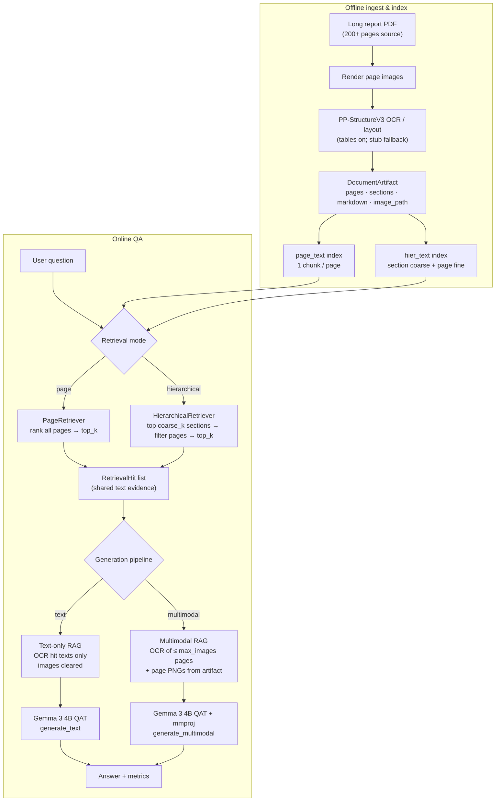
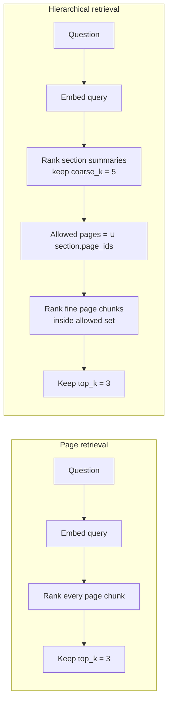
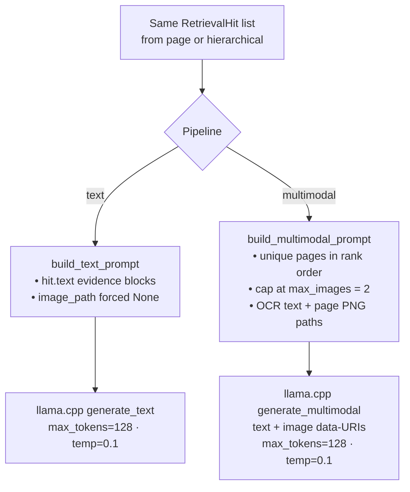
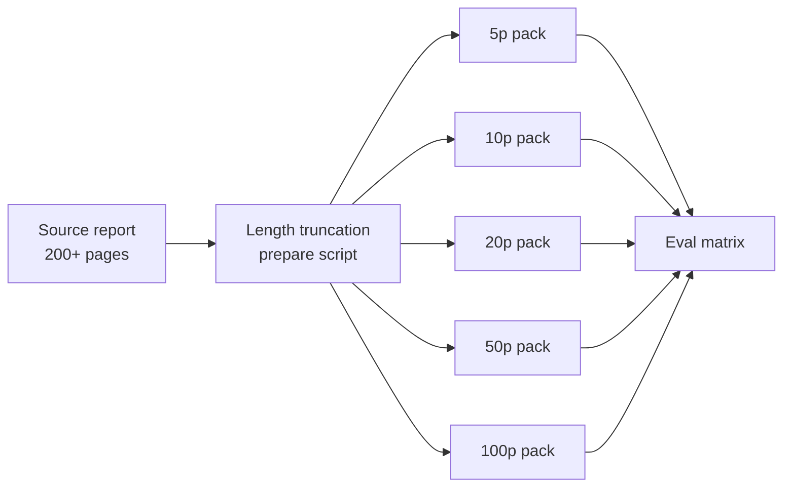
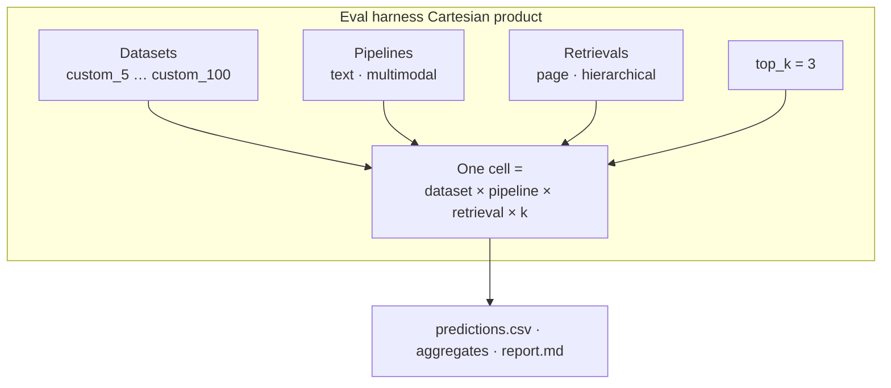

# pdf-vlm — Local Multimodal Document QA

**Quantized Gemma 3 4B** + **PaddleOCR PP-StructureV3** for private, on-device document question answering over **long reports (200+ pages)**.

This repo is a **product-shaped research stack**: YAML configs, shared retrieval for a fair text vs multimodal A/B, an evaluation harness, and local inference benchmarks — not a notebook dump.

| Axis | What we compare |
|------|-----------------|
| Generation | **Text-only RAG** vs **multimodal RAG** (same retrieved pages; MM adds page images) |
| Retrieval | **Page-level** vs **hierarchical** (coarse section → fine page) |
| Document length | Length-truncated packs **5 / 10 / 20 / 50 / 100** pages carved from **200+ page** source reports |
| Practicality | TTFT, tok/s, e2e latency, RSS / VRAM (separate inference bench) |

> **Colab:** open [`notebooks/pdf_vlm_colab.ipynb`](notebooks/pdf_vlm_colab.ipynb) — [](https://colab.research.google.com/github/mAn-He/pdf_vlm/blob/main/notebooks/pdf_vlm_colab.ipynb)

> **Status (2026-07-26):** Full answer-quality matrix measured on Colab (T4-class GPU) with Gemma QAT GGUF + mmproj. Baseline export: `pdf_vlm_all_results_20260726_123503` (**152** valid prediction rows, **20/20** matrix cells). Results under `results/runs/**` are gitignored — keep local/Colab exports; do not commit large zip dumps.

---

## What we set out to learn

**200+ page** private reports (financial / industrial filings) are a bad fit for cloud VLMs. We built a **local** stack and measured:

1. **Does multimodal generation help** over text-only RAG when both share the **same retrieved pages**?
2. **Does hierarchical retrieval help** over flat page retrieval as visible context grows from 5 → 100 pages (toward full-report scale)?
3. **How do answer quality and latency scale** with page count on a small local VLM?
4. **Is the stack interactive enough** (TTFT / tok/s / VRAM) for laptop/desktop use?

**Primary metrics:** ANLS (primary), EM, token F1, recall@k / page-hit@k, end-to-end & generation latency, peak RSS/VRAM.

**Fairness rule:** multimodal RAG uses the **same text index and retriever** as text-only; images are attached only for retrieved pages (capped by `max_images`), never the full PDF.

---

## 1. Problem

Long reports break naive RAG:

- OCR text alone loses layout, tables, and figures.
- Flat page retrieval over tens–hundreds of pages is noisy and expensive for a small local VLM.
- Cloud multimodal APIs are strong but often unacceptable for **private documents**.

**Goal:** a **local** pipeline that answers questions on long reports with a small multimodal model, measures when text-only fails, and keeps latency/memory practical on a laptop/desktop (or a single Colab GPU).

---

## 2. Why Gemma 3 4B + local QAT?

| Criterion | Choice |
|-----------|--------|
| Size | 4B — fits local / Colab VRAM with headroom for OCR + embeddings |
| Modality | Native **text + image** (SigLIP) via official mmproj |
| Weights | **QAT Q4_0 GGUF** (~3GB) — Google-published, quality-aware quant |
| Runtime | **llama.cpp / llama-cpp-python** (CPU or CUDA) |
| Privacy | Documents never need to leave the machine |

Refs: [Gemma 3 model card](https://ai.google.dev/gemma/docs/core/model_card_3) · [llama.cpp integration](https://ai.google.dev/gemma/docs/integrations/llamacpp)

---

## 3. How RAG works in this repo

### 3.1 End-to-end pipeline

Offline we ingest a PDF into a `DocumentArtifact`, then build **text-only** indexes. Online, a question hits one retriever; generation is either text-only or multimodal. Vision is **not** used for retrieval — only for generation after text retrieval.



### 3.2 Page vs hierarchical retrieval

Both modes embed the **question as text** and rank **text chunks**. Hierarchical only changes *which pages are candidates*.



| | Page | Hierarchical |
|--|------|----------------|
| Index | `indices/{doc_id}/page_text` | `indices/{doc_id}/hier_text` |
| Units | 1 chunk per page (OCR markdown + tables) | Coarse: section title/summary · Fine: page chunks |
| Query path | Global top-k pages | Coarse filter → fine top-k |
| Colab defaults | `top_k=3` | `coarse_k=5`, then `top_k=3` |

### 3.3 Text-only vs multimodal generation (same hits)



**What the model actually sees**

| Pipeline | Prompt contents | Images |
|----------|-----------------|--------|
| Text-only | System prompt + question + OCR evidence from hits | None |
| Multimodal | System prompt + question + OCR for ≤2 pages + image manifest | Page PNGs for those pages only |

### 3.4 Repo layout

```text
configs/          YAML (model, OCR, retrieval, experiments)
src/pdf_vlm/      llm · ocr · data · index · retrieve · rag · eval · bench
scripts/          download · ingest · index · RAG · harness · bench · Colab helpers
data/             custom/{5,10,20,50,100} length packs from long reports (+ optional public benches)
indices/          per-doc retrieval indexes (stable content-hash doc_id)
results/          runs · reports · figures · bench  (gitignored artifacts)
docs/             design notes + stage docs
```

**Doc ID note:** `doc_id` is a **content hash** (`stable_doc_id`). Path-based IDs differ between Windows and Colab — rebuild or sync questions to index stems before eval (`scripts/sync_questions_to_indices.py`).

---

## 4. Experiment design (what we ran)

### 4.1 Dataset: long reports → length buckets

Source documents are **200+ page** corporate / financial-style reports. For a controlled length ablation we build truncated packs:

| Pack | Pages visible to the system | Role |
|------|-----------------------------|------|
| `custom_5` … `custom_100` | 5 / 10 / 20 / 50 / 100 | Same domain QA; only document length changes |
| Demo Acme pack | short | Smoke tests / inference bench only |

Questions mix **text** and **table** items. Schema: `DatasetBundle` → `DatasetDocument` → `QAExample`.



### 4.2 Comparison matrix

**2 × 2 × length** (primary Colab study) = **20 cells**:



| Pipeline | Retrieval | Length buckets | top-k |
|----------|-----------|----------------|-------|
| text / multimodal | page / hierarchical | **5 · 10 · 20 · 50 · 100** | 3 |

Config: [`configs/experiments/eval_hw_wia_colab.yaml`](configs/experiments/eval_hw_wia_colab.yaml)

| Setting | Value |
|---------|-------|
| Model | `configs/models/gemma3_4b_qat_colab.yaml` |
| OCR | `configs/ocr/pp_structure_v3_colab.yaml` (tables enabled) |
| Generation | `max_tokens=128`, `temperature=0.1` |
| Multimodal images | `max_images=2` |
| Hierarchical coarse | `coarse_k=5` |
| Seed | 42 (+ `config_snapshot.json` / `seed_snapshot.json` per run) |
| Primary metric | ANLS |

**VRAM practice:** run **text** then **multimodal** in separate processes (do not load both Gemma contexts at once).

### 4.3 What each axis is testing

| Axis | Hypothesis | Observed (see §6) |
|------|------------|-------------------|
| Text vs multimodal | Vision should help table/layout QA when retrieval is held fixed | **Rejected under ANLS** — text ≫ multimodal |
| Page vs hierarchical | Coarse→fine should help as length grows | **Rejected for accuracy** — page ≥ hier; hier worse on 50/100 |
| Length scaling | Quality/latency degrade toward full-report scale | **Partially confirmed** — 5p best; 10p anomaly; 20–100 plateau |
| Practicality | Q4_0 Gemma usable interactively on one GPU | **Confirmed** for text; multimodal ~2–3× slower |

### 4.4 Tools & scripts

| Tool | Role |
|------|------|
| `scripts/prepare_hw_report_dataset.py` | Build length-truncated packs + questions from long source PDFs |
| `scripts/colab_prepare_custom.py` | Colab ingest + index (OCR / stub / hash or BGE embedder) |
| `scripts/sync_questions_to_indices.py` | Remap `questions.json` doc_ids to index stems |
| `scripts/build_retrieval_indexes.py` | Build `page_text` / `hier_text` indexes |
| `scripts/run_eval_harness.py` | Full matrix eval → CSV / JSON / Markdown reports |
| `scripts/compare_retrieval.py` | Retrieval-only page vs hierarchical A/B |
| `scripts/bench_gemma_inference.py` | TTFT / tok/s / RSS / VRAM practicality bench |
| `notebooks/pdf_vlm_colab.ipynb` | End-to-end Colab runner |

```bash
# Full length matrix — text first (after GGUF + indexes exist)
python scripts/run_eval_harness.py \
  --config configs/experiments/eval_hw_wia_colab.yaml \
  --datasets custom_5,custom_10,custom_20,custom_50,custom_100 \
  --pipelines text \
  --retrievals page,hierarchical \
  --top-k 3

# Multimodal in a fresh process (VRAM-safe)
python scripts/run_eval_harness.py \
  --config configs/experiments/eval_hw_wia_colab.yaml \
  --pipelines multimodal \
  --retrievals page,hierarchical \
  --top-k 3

# Inference practicality
python scripts/bench_gemma_inference.py --repeats 3
```

Optional public benches (scaffolded): MP-DocVQA, MMLongBench-Doc subset — see `docs/evaluation_harness.md`.

---

## 5. Key results (Colab, 2026-07-26)

**Run:** full generation (`dry_run=false`), seed 42.  
**Valid rows:** 152 (discard empty/mismatch runs such as `*_121830`).  
**Coverage:** all 20 cells of `{text, multimodal} × {page, hierarchical} × {5,10,20,50,100}`.

### 5.1 Headline

| Finding | Result |
|---------|--------|
| Text vs multimodal (mean ANLS) | **0.411** vs **0.054** (n=76 each) |
| Text · page vs text · hierarchical | **0.490** vs **0.332** (n=38 each) |
| Best short-doc cell | text × either retrieval @ **5p → 0.75** ANLS, recall@3 = **1.0** |
| Long pack (50/100) text | **page 0.542** vs **hierarchical 0.270** |
| Multimodal EM | **0.0** across all multimodal rows |
| gold_answer_contained | **0.50** (same for both pipelines — evidence ceiling) |

### 5.2 ANLS by page bucket

| Bucket | Text | Multimodal | Recall@3 (shared retriever) |
|--------|------|------------|-----------------------------|
| 5p | **0.750** | 0.141 | 1.00 |
| 10p | 0.183 | 0.000 | 0.75 |
| 20p | 0.371 | 0.063 | 0.69 |
| 50p | 0.406 | 0.045 | 0.59 |
| 100p | 0.406 | 0.045 | 0.59 |

`custom_10` drop is **retrieval-driven** (entity / cover-page questions retrieving irrelevant metadata pages), not a random crash — reproduced across two Colab exports.

### 5.3 Full cell matrix (mean ANLS)

| Bucket | Text·page | Text·hier | MM·page | MM·hier | n / cell |
|--------|-----------|-----------|---------|---------|----------|
| 5p | 0.750 | 0.750 | 0.141 | 0.141 | 4 |
| 10p | 0.183 | 0.183 | 0.000 | 0.000 | 4 |
| 20p | 0.371 | 0.371 | 0.063 | 0.063 | 8 |
| 50p | **0.542** | 0.270 | 0.045 | 0.045 | 11 |
| 100p | **0.542** | 0.270 | 0.045 | 0.045 | 11 |

### 5.4 Question type

| Type | Text ANLS | Multimodal ANLS |
|------|-----------|-----------------|
| Text questions | 0.367 | 0.019 |
| Table questions | **0.556** | 0.167 |

Multimodal did **not** outperform text on tables under string ANLS in this setup.

### 5.5 Latency & memory (eval means)

| Config | Latency (ms) | Generation (ms) | Peak VRAM (MB) |
|--------|--------------|-----------------|----------------|
| Text · page | ~5,000 | ~560 | ~8,800 |
| Text · hier | ~6,300 | ~570 | ~13,400 |
| MM · page | ~5,200 | ~1,140 | ~10,900 |
| MM · hier | ~6,800 | ~1,100 | ~15,500 |

### 5.6 Inference practicality bench (separate)

From `gemma_infer_bench_20260726_121834` (Colab GPU):

- Text decode ~**26 tok/s**, best TTFT ~**57 ms** → scored **interactive_local**
- Multimodal top-3 e2e ~**2.9×** text
- Peak RSS ~2.7 GB; VRAM peak ~8 GB on the bench workload

Bench ≠ answer quality (synthetic / short prompts). Use it only for UX / capacity claims.

### 5.7 How to read multimodal ANLS

Low multimodal ANLS is **partly metric + prompt**, not only “model useless”:

- Answers often in **English** while gold is **Korean**
- Models append `[page N]` citations that string ANLS punishes
- Recall@3 matches text (same retriever) — failures are mostly **generation / format**

Re-score with citation stripping + Korean-forced decoding (or LLM-as-judge) before claiming semantic failure.

### 5.8 Reproducibility

A prior export (`…_042652`) matched these ANLS cells within **±0.008**, but skipped some long-doc multimodal+hierarchical cells (CUDA OOM). The **`…_123503`** export is the preferred complete baseline.

---

## 6. Error analysis (observed)

| Failure mode | Evidence | Mitigation |
|--------------|----------|------------|
| Entity / cover-page miss on longer packs | Pred says name “not in evidence”; recall@3=0 | Boost title/cover pages; metadata field; better embedder (BGE-M3) |
| Hierarchical hurts 50/100 text | page 0.54 vs hier 0.27; lower recall@3 | Prefer page retrieval for this corpus; tune `coarse_k` |
| Multimodal ANLS collapse | English + `[page N]`; EM=0 | Prompt: Korean only, no citations; re-evaluate |
| Empty eval (`n_rows=0`) | Path-hash `doc_id` ≠ index stem across machines | Content-hash IDs + `sync_questions_to_indices` |
| OOM loading text+MM together | Dual Gemma contexts | Run text and multimodal **sequentially**; unload between |

---

## 7. Limits & next steps

**Limits**

- Small n per cell (4–11 questions) — directionally solid, not publication-grade CI.
- Buckets are **truncated views** of 200+ page reports, not always the full source file in one index.
- Colab often uses a **hashing embedder** to avoid BGE-M3 RAM spikes → understates retrieval vs production embeddings.
- Evidence contain rate ~50% caps achievable exact match.
- ANLS understates paraphrastic multimodal answers.
- Public MP-DocVQA / MMLongBench full dumps may still be incomplete in-tree.

**Next**

1. Force Korean + no citation in multimodal prompts → re-score ANLS / add judge metric  
2. Rebuild indexes with BGE-M3 when RAM allows  
3. Fix cover-page / entity retrieval for identity questions  
4. Expand the question set (more table & multi-hop items; optional full 200+ page index runs)  
5. Optional: publish anonymized aggregate CSVs under `results/colab_export/` (not raw run zips)

---

## Quick start

### Google Colab

1. Open [pdf_vlm_colab.ipynb](https://colab.research.google.com/github/mAn-He/pdf_vlm/blob/main/notebooks/pdf_vlm_colab.ipynb) (**GPU** runtime).
2. Clone into `/content/pdf_vlm_repo` (avoid shadowing the `pdf_vlm` package name).
3. Run prepare → sync questions → download GGUF (`HF_TOKEN` + license) → **text** eval → **multimodal** eval → zip `results/`.
4. Keep `DRY_RUN = False` only after weights exist.

```bash
python scripts/colab_prepare_custom.py --buckets 5,10,20,50,100 --enrich-pdf-text
python scripts/sync_questions_to_indices.py
python scripts/run_eval_harness.py --config configs/experiments/eval_hw_wia_colab.yaml --pipelines text
python scripts/run_eval_harness.py --config configs/experiments/eval_hw_wia_colab.yaml --pipelines multimodal
```

### Local install

```bash
pip install -e .
# Windows CPU wheel for llama.cpp (recommended)
pip install llama-cpp-python --extra-index-url https://abetlen.github.io/llama-cpp-python/whl/cpu

# Optional extras
pip install -e ".[llm,ocr,index,gpu-metrics,viz,dev]"

# HF gated model (required for real generation)
# 1) https://huggingface.co/google/gemma-3-4b-it-qat-q4_0-gguf  (accept license)
# 2) huggingface-cli login   # or set HF_TOKEN
python scripts/download_models.py --with-mmproj
python scripts/smoke_gemma.py

# Demo / short pack
python scripts/ingest_pdf.py data/custom/5/*.pdf
python scripts/build_retrieval_indexes.py --doc-id <DOC_ID> --enrich-pdf-text --hash-embedder
python scripts/run_eval_harness.py --config configs/experiments/eval_hw_wia_colab.yaml --datasets custom_5
```

CLI: `python -m pdf_vlm --help`

---

## Docs

| Doc | Topic |
|-----|-------|
| [`final_report.md`](final_report.md) | Longer narrative report (may lag Colab numbers — prefer §5 above) |
| [`docs/resume_bullets.md`](docs/resume_bullets.md) | Resume bullets |
| [`docs/design.md`](docs/design.md) | Architecture |
| [`docs/gemma_local_inference.md`](docs/gemma_local_inference.md) | Local Gemma setup |
| [`docs/text_only_rag.md`](docs/text_only_rag.md) | Text RAG |
| [`docs/multimodal_rag.md`](docs/multimodal_rag.md) | Multimodal RAG |
| [`docs/retrieval_granularity.md`](docs/retrieval_granularity.md) | Page vs hierarchical |
| [`docs/evaluation_harness.md`](docs/evaluation_harness.md) | Eval matrix |
| [`docs/inference_benchmark.md`](docs/inference_benchmark.md) | TTFT / tok/s / memory |

## License / model terms

Code in this repo: see project license if present. **Gemma weights** are subject to Google’s Gemma license on Hugging Face — accept before download.
