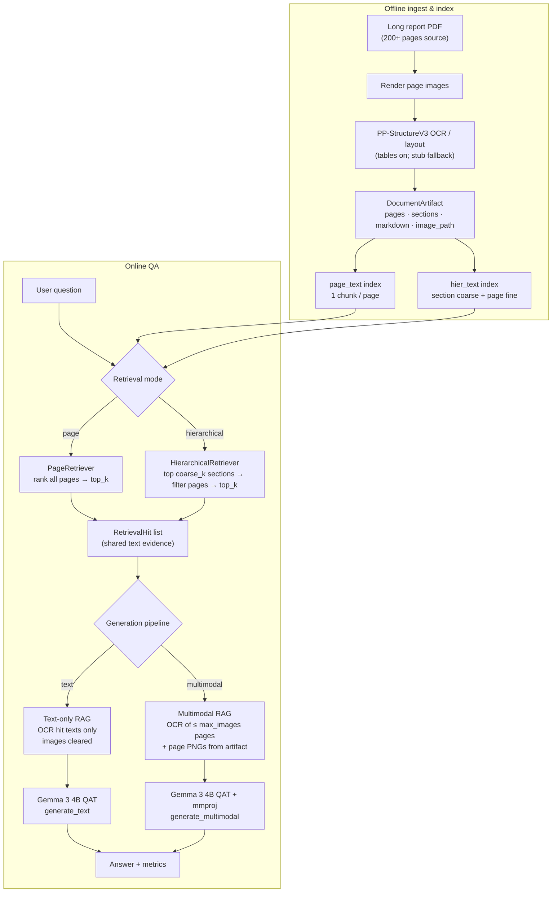
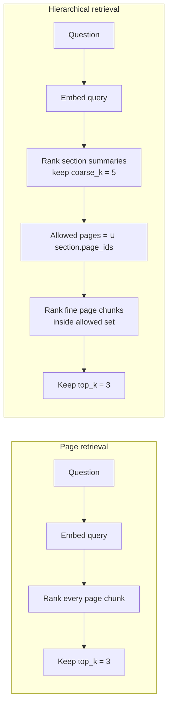
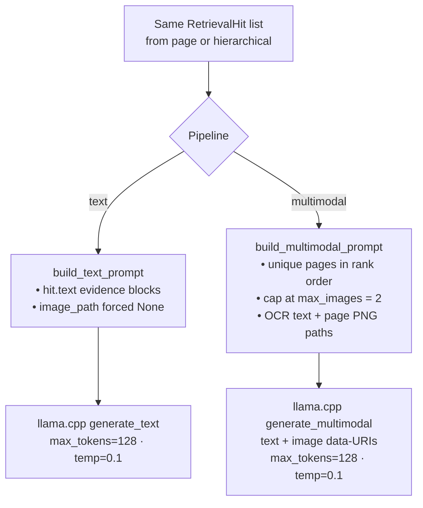
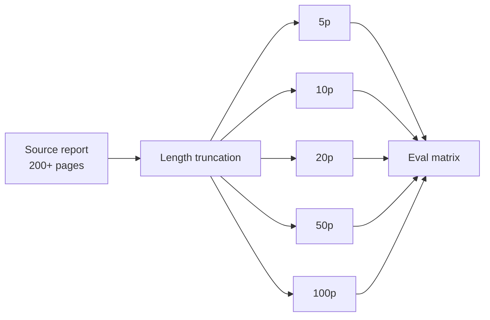
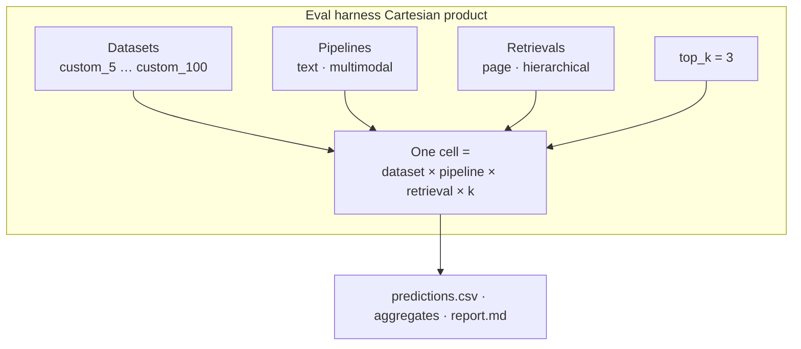

# pdf-vlm — Local Multimodal Document QA

**Quantized Gemma 3 4B** + **PaddleOCR PP-StructureV3** for private, on-device document question answering over **long reports (200+ pages)**.

This repo is a **product-shaped research stack**: YAML configs, a **shared text retriever** so text vs multimodal differ only at generation, an evaluation harness, and local inference benchmarks — not a notebook dump.

| Axis | What we measure |
|------|-----------------|
| Generation | **Text-only RAG** vs **multimodal RAG** (same retrieved pages; MM adds page images) |
| Retrieval | **Page-level** vs **hierarchical** (coarse section → fine page) — *exploratory under hashing embedder* |
| Document length | Length-truncated packs **5 / 10 / 20 / 50 / 100** pages from **200+ page** source reports |
| Practicality | TTFT, tok/s, e2e latency, RSS / VRAM (separate inference bench) |

> **Colab:** open [`notebooks/pdf_vlm_colab.ipynb`](notebooks/pdf_vlm_colab.ipynb) — [](https://colab.research.google.com/github/mAn-He/pdf_vlm/blob/main/notebooks/pdf_vlm_colab.ipynb)

> **Status (2026-07-26):** Full generation matrix on Colab (T4-class GPU). Baseline export `pdf_vlm_all_results_20260726_123503` (**152** valid rows, **20/20** cells). Numbers below are **directional, not statistically powered** (n = 4–11 per cell). Results under `results/runs/**` are gitignored.

---

## What this project is really selling

Accuracy tables are provisional. The sharper engineering story is:

1. **Controlled modality A/B** — multimodal never gets a different retriever. Both pipelines call the same text index; MM only attaches page images for retrieved hits (`max_images≤2`). If text and MM diverge, the gap is generation, not “MM saw better pages.”
2. **Cross-machine eval that does not silently die** — `doc_id = stable_doc_id` (content hash of the PDF). Path-hash IDs broke Windows ↔ Colab (`n_rows=0`). Content-hash + `sync_questions_to_indices.py` made the matrix reproducible.
3. **Honest metric literacy** — raw string ANLS on multimodal outputs is dominated by English paraphrases and `[page N]` citations; we report raw **and** citation-stripped re-scores so the protocol’s effect is visible (§5.4).

Interview takeaway: this is less “we beat hierarchical RAG” and more “we know how to isolate RAG variables and keep a local DocQA harness alive across environments.”

---

## What we set out to learn

**200+ page** private reports are a bad fit for cloud VLMs. We built a **local** stack and asked:

1. With retrieval **held fixed**, does multimodal generation help over text-only under a DocVQA-style string metric?
2. Does hierarchical retrieval help as visible length grows — and can we separate that from **embedder quality**?
3. How do quality / latency behave across length packs toward full-report scale?
4. Is Q4_0 Gemma interactive enough (TTFT / tok/s / VRAM) on one GPU?

**Primary metrics:** ANLS (primary), EM, token F1, recall@k / page-hit@k, latency, peak RSS/VRAM.

---

## 1. Problem

Long reports break naive RAG:

- OCR text alone loses layout, tables, and figures.
- Flat page retrieval over tens–hundreds of pages is noisy and expensive for a small local VLM.
- Cloud multimodal APIs are strong but often unacceptable for **private documents**.

**Goal:** a **local** pipeline that answers questions on long reports with a small multimodal model, keeps modality comparisons fair, and stays practical on a laptop/desktop (or a single Colab GPU).

---

## 2. Why Gemma 3 4B + local QAT?

| Criterion | Choice |
|-----------|--------|
| Size | 4B — fits local / Colab VRAM with headroom for OCR + embeddings |
| Modality | Native **text + image** (SigLIP) via official mmproj |
| Weights | **QAT Q4_0 GGUF** (~3GB) — Google-published, quality-aware quant |
| Runtime | **llama.cpp / llama-cpp-python** (CPU or CUDA) |
| Privacy | Documents never need to leave the machine |

Refs: [Gemma 3 model card](https://ai.google.dev/gemma/docs/core/model_card_3) · [llama.cpp integration](https://ai.google.dev/gemma/docs/integrations/llamacpp)

---

## 3. How RAG works in this repo

### 3.1 End-to-end pipeline

Offline we ingest a PDF into a `DocumentArtifact`, then build **text-only** indexes. Online, a question hits one retriever; generation is either text-only or multimodal. Vision is **not** used for retrieval — only for generation after text retrieval.



### 3.2 Page vs hierarchical retrieval

Both modes embed the **question as text** and rank **text chunks**. Hierarchical only changes *which pages are candidates*.



| | Page | Hierarchical |
|--|------|----------------|
| Index | `indices/{doc_id}/page_text` | `indices/{doc_id}/hier_text` |
| Units | 1 chunk per page (OCR markdown + tables) | Coarse: section title/summary · Fine: page chunks |
| Query path | Global top-k pages | Coarse filter → fine top-k |
| Colab defaults | `top_k=3` | `coarse_k=5`, then `top_k=3` |

**Embedder caveat:** Colab often uses a **hashing embedder** (RAM). Coarse section ranking needs semantic similarity; hashing is closer to lexical matching and **structurally disadvantages hierarchical retrieval**. Treat page-vs-hier ANLS gaps as **confounded with embedder choice** until reproduced with BGE-M3 (or similar).

### 3.3 Text-only vs multimodal generation (same hits)



| Pipeline | Prompt contents | Images |
|----------|-----------------|--------|
| Text-only | System prompt + question + OCR evidence from hits | None |
| Multimodal | System prompt + question + OCR for ≤2 pages + image manifest | Page PNGs for those pages only |

### 3.4 Reproducible `doc_id` (MLOps detail)

```text
PDF bytes → sha256 → stable_doc_id  →  indices/{doc_id}/…
                                         questions.json doc_id must match
```

Path-based IDs (`hash(absolute_path)`) differ across Windows vs Colab clones → harness skips every cell (`n_rows=0`). **Content-hash IDs** + optional `scripts/sync_questions_to_indices.py` keep QA rows aligned with indexes. This is what made the second Colab export a complete 20-cell matrix.

### 3.5 Repo layout

```text
configs/          YAML (model, OCR, retrieval, experiments)
src/pdf_vlm/      llm · ocr · data · index · retrieve · rag · eval · bench
scripts/          download · ingest · index · RAG · harness · bench · Colab helpers
data/             custom/{5,10,20,50,100} length packs from long reports
indices/          per-doc retrieval indexes (stable content-hash doc_id)
results/          runs · reports · figures · bench  (gitignored)
docs/             design notes + stage docs
```

---

## 4. Experiment design (what we ran)

### 4.1 Dataset: long reports → length buckets

Source documents are **200+ page** corporate / financial-style reports. For a controlled length ablation we build truncated packs (same cover start page, first *N* pages):

| Pack | Pages in PDF | Role |
|------|--------------|------|
| `custom_5` … `custom_100` | 5 / 10 / 20 / 50 / 100 | Distractor mass ↑; domain fixed |
| Demo Acme pack | short | Smoke / inference bench only |

Questions are included only when their **gold evidence page** falls inside the truncated pack. Schema: `DatasetBundle` → `DatasetDocument` → `QAExample`.



**Why 50p and 100p look identical in the score table (§5.3):** not because the PDFs are copies (different SHA, 50 vs 100 pages). By design, every question’s gold evidence sits on **relative pages ≤ 28**, so **50p and 100p share the exact same 11 questions**. The 100p pack only adds later distractor pages. With deterministic decoding, per-row correctness matched → identical cell means. **50→100 is not an identified length step** for answer quality; it mainly stress-tests retrieval noise. Fix for a future run: add questions whose evidence lives in pages 50–99, or drop 100p from the headline length curve.

### 4.2 Comparison matrix

**2 × 2 × length** = **20 cells** (directional):



Config: [`configs/experiments/eval_hw_wia_colab.yaml`](configs/experiments/eval_hw_wia_colab.yaml)

| Setting | Value |
|---------|-------|
| Model | `configs/models/gemma3_4b_qat_colab.yaml` |
| OCR | `configs/ocr/pp_structure_v3_colab.yaml` (tables enabled) |
| Generation | `max_tokens=128`, `temperature=0.1` |
| Multimodal images | `max_images=2` |
| Hierarchical coarse | `coarse_k=5` |
| Seed | 42 (+ config/seed snapshots per run) |
| Primary metric | ANLS |
| Typical Colab embedder | hashing (BGE-M3 optional when RAM allows) |

**VRAM practice:** run **text** then **multimodal** in separate processes.

### 4.3 How to read each axis (careful claims)

| Axis | What we can say | What we should not claim yet |
|------|-----------------|------------------------------|
| Text vs multimodal under **raw ANLS** | Protocol + format dominate; text scores much higher | “Vision is useless for DocQA” |
| Text vs multimodal after **citation strip** | Still below text; 57/76 MM answers English-only vs Korean gold | Final modality ranking without Korean-forced regen / judge |
| Page vs hierarchical | Under hashing embedder, page often ≥ hier on long packs | Hierarchical is generally inferior (need BGE-M3 redo) |
| Length 5→20→50 | Directional quality / recall trends | 50 vs 100 as independent length points |
| Practicality bench | Text interactive; MM ~2–3× slower | Accuracy |

### 4.4 Tools & scripts

| Tool | Role |
|------|------|
| `scripts/prepare_hw_report_dataset.py` | Truncate long PDFs + build questions |
| `scripts/colab_prepare_custom.py` | Colab ingest + index |
| `scripts/sync_questions_to_indices.py` | Align question `doc_id`s to index stems |
| `scripts/build_retrieval_indexes.py` | Build `page_text` / `hier_text` |
| `scripts/run_eval_harness.py` | Matrix eval → CSV / JSON / Markdown |
| `scripts/compare_retrieval.py` | Retrieval-only A/B |
| `scripts/bench_gemma_inference.py` | TTFT / tok/s / memory |
| `notebooks/pdf_vlm_colab.ipynb` | End-to-end Colab runner |

```bash
python scripts/run_eval_harness.py \
  --config configs/experiments/eval_hw_wia_colab.yaml \
  --datasets custom_5,custom_10,custom_20,custom_50,custom_100 \
  --pipelines text \
  --retrievals page,hierarchical \
  --top-k 3

python scripts/run_eval_harness.py \
  --config configs/experiments/eval_hw_wia_colab.yaml \
  --pipelines multimodal \
  --retrievals page,hierarchical \
  --top-k 3

python scripts/bench_gemma_inference.py --repeats 3
```

---

## 5. Key results (Colab, 2026-07-26)

**Scope note:** **directional, not statistically powered.** Cells have **n = 4–11** questions. Treat ranks and gaps as hypotheses to re-test with a larger item bank and a semantic embedder — not as final system rankings.

**Run:** `dry_run=false`, seed 42. **152** valid rows after discarding empty mismatch runs. Complete **20/20** cells.

### 5.1 Headline (with caveats)

| Finding | Number | Caveat |
|---------|--------|--------|
| Text mean raw ANLS | **0.411** (n=76) | Shared retriever with MM |
| Multimodal mean raw ANLS | **0.054** (n=76) | Protocol-penalized (§5.4) |
| MM after citation strip (offline) | **0.159** | Still ≪ text; English remains |
| Text · page vs text · hier | 0.490 vs 0.332 | Confounded w/ hashing embedder |
| Best short cell | text @ 5p **0.75**, recall@3 **1.0** | Small n=4 |
| gold_answer_contained | **0.50** both pipelines | Evidence ceiling, not modality |

### 5.2 ANLS by page bucket

| Bucket | Text | Multimodal (raw) | Recall@3 | Note |
|--------|------|------------------|----------|------|
| 5p | **0.750** | 0.141 | 1.00 | |
| 10p | 0.183 | 0.000 | 0.75 | Retrieval miss on entity Qs |
| 20p | 0.371 | 0.063 | 0.69 | |
| 50p | 0.406 | 0.045 | 0.59 | Same Q set as 100p |
| 100p | 0.406 | 0.045 | 0.59 | Extra distractors only |

### 5.3 Full cell matrix (mean raw ANLS)

| Bucket | Text·page | Text·hier | MM·page | MM·hier | n / cell |
|--------|-----------|-----------|---------|---------|----------|
| 5p | 0.750 | 0.750 | 0.141 | 0.141 | 4 |
| 10p | 0.183 | 0.183 | 0.000 | 0.000 | 4 |
| 20p | 0.371 | 0.371 | 0.063 | 0.063 | 8 |
| 50p | 0.542 | 0.270 | 0.045 | 0.045 | 11 |
| 100p | 0.542 | 0.270 | 0.045 | 0.045 | 11 |

Identical **50p / 100p** rows are expected under the current question bank (same 11 items, evidence ≤ page 28) — see §4.1. Do not present them as independent confirmation that “search converged.”

### 5.4 Multimodal: the evaluation protocol writes the headline

Raw ANLS suggests multimodal “failed.” A fairer framing:

> We verified that **the scoring protocol manufactures a large part of the MM gap.**

| Check | Result |
|-------|--------|
| Same retriever recall@3 as text | Yes (by construction) |
| MM answers English-only-ish vs Korean gold | **57 / 76** |
| Offline ANLS after stripping `[page N]` / `[pages …]` | **0.054 → 0.159** (text unchanged at 0.411) |
| EM under raw strings | 0.0 for all MM rows |

So the strong claim is **not** “vision never helps.” It is: **string ANLS + citation style + language mismatch is a hostile metric for this VLM path**, and any modality conclusion needs (1) citation-free decoding, (2) Korean-forced generation or translation-aware scoring, and/or (3) LLM-as-judge — then re-rank text vs MM.

### 5.5 Question type (raw ANLS)

| Type | Text | Multimodal |
|------|------|------------|
| Text Q | 0.367 | 0.019 |
| Table Q | 0.556 | 0.167 |

Under raw ANLS, MM does not win on tables either — again entangled with language/citation format.

### 5.6 Latency & memory (eval means)

| Config | Latency (ms) | Generation (ms) | Peak VRAM (MB) |
|--------|--------------|-----------------|----------------|
| Text · page | ~5,000 | ~560 | ~8,800 |
| Text · hier | ~6,300 | ~570 | ~13,400 |
| MM · page | ~5,200 | ~1,140 | ~10,900 |
| MM · hier | ~6,800 | ~1,100 | ~15,500 |

### 5.7 Inference practicality bench

From `gemma_infer_bench_20260726_121834` (Colab GPU): text ~**26 tok/s**, TTFT ~**57 ms** (`interactive_local`); multimodal top-3 e2e ~**2.9×** text. Bench ≠ answer quality.

### 5.8 Reproducibility

Prior export `…_042652` matched ANLS cells within **±0.008** but OOM-skipped some long MM+hier cells. Prefer **`…_123503`** as the complete baseline.

---

## 6. Error analysis

| Failure mode | Evidence | Mitigation |
|--------------|----------|------------|
| 50p ≡ 100p scores | Same 11 Qs; evidence ≤ p28 | Add late-page gold Qs or drop 100p from length claims |
| Hier &lt; page on long packs | Lower recall@3 under hashing embedder | Re-run with BGE-M3 before strategy claims |
| MM raw ANLS collapse | English + `[page N]` | Strip citations; Korean-forced regen; judge metric |
| Entity / cover miss | recall@3=0 on identity Qs | Title boost; metadata field; better embedder |
| Empty eval | Path-hash `doc_id` mismatch | `stable_doc_id` + sync script |
| Dual-model OOM | Text+MM contexts together | Sequential pipeline runs |

---

## 7. Limits & next steps

**Limits (say these first in a portfolio)**

- **Directional, not statistically powered** — n = 4–11 per cell.
- Hierarchical vs page is **confounded with hashing embedder**.
- Multimodal ranking under raw ANLS is **confounded with output language / citations**.
- 50p vs 100p is **not an independent QA length contrast** under the current item bank.
- Evidence-contain rate ~50% caps EM.

**Next (high leverage)**

1. Offline/online: citation-free + Korean-forced MM decode → publish side-by-side ANLS / judge scores  
2. Rebuild indexes with **BGE-M3**, re-run page vs hierarchical only  
3. Add questions with gold evidence in pages 50–99 (or full 200+ index)  
4. Expand item count for bootstrap CIs  
5. Optional anonymized aggregate CSVs under `results/colab_export/`

---

## Quick start

### Google Colab

1. Open [pdf_vlm_colab.ipynb](https://colab.research.google.com/github/mAn-He/pdf_vlm/blob/main/notebooks/pdf_vlm_colab.ipynb) (**GPU**).
2. Clone into `/content/pdf_vlm_repo` (avoid shadowing package `pdf_vlm`).
3. Prepare → sync questions → GGUF (`HF_TOKEN`) → **text** eval → **multimodal** eval → zip `results/`.

```bash
python scripts/colab_prepare_custom.py --buckets 5,10,20,50,100 --enrich-pdf-text
python scripts/sync_questions_to_indices.py
python scripts/run_eval_harness.py --config configs/experiments/eval_hw_wia_colab.yaml --pipelines text
python scripts/run_eval_harness.py --config configs/experiments/eval_hw_wia_colab.yaml --pipelines multimodal
```

### Local install

```bash
pip install -e .
pip install llama-cpp-python --extra-index-url https://abetlen.github.io/llama-cpp-python/whl/cpu
pip install -e ".[llm,ocr,index,gpu-metrics,viz,dev]"

# Accept Gemma license on HF, then:
python scripts/download_models.py --with-mmproj
python scripts/smoke_gemma.py

python scripts/ingest_pdf.py data/custom/5/*.pdf
python scripts/build_retrieval_indexes.py --doc-id <DOC_ID> --enrich-pdf-text --hash-embedder
python scripts/run_eval_harness.py --config configs/experiments/eval_hw_wia_colab.yaml --datasets custom_5
```

CLI: `python -m pdf_vlm --help`

---

## Docs

| Doc | Topic |
|-----|-------|
| [`final_report.md`](final_report.md) | Longer narrative (may lag — prefer §5) |
| [`docs/resume_bullets.md`](docs/resume_bullets.md) | Resume bullets |
| [`docs/design.md`](docs/design.md) | Architecture |
| [`docs/gemma_local_inference.md`](docs/gemma_local_inference.md) | Local Gemma |
| [`docs/text_only_rag.md`](docs/text_only_rag.md) | Text RAG |
| [`docs/multimodal_rag.md`](docs/multimodal_rag.md) | Multimodal RAG |
| [`docs/retrieval_granularity.md`](docs/retrieval_granularity.md) | Page vs hierarchical |
| [`docs/evaluation_harness.md`](docs/evaluation_harness.md) | Eval matrix |
| [`docs/inference_benchmark.md`](docs/inference_benchmark.md) | TTFT / tok/s / memory |

## License / model terms

Code in this repo: see project license if present. **Gemma weights** follow Google’s Gemma license on Hugging Face — accept before download.
